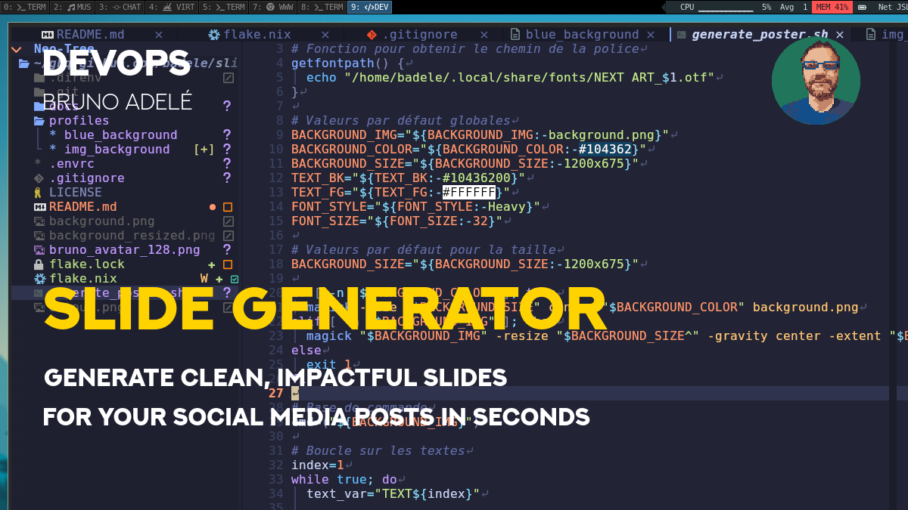
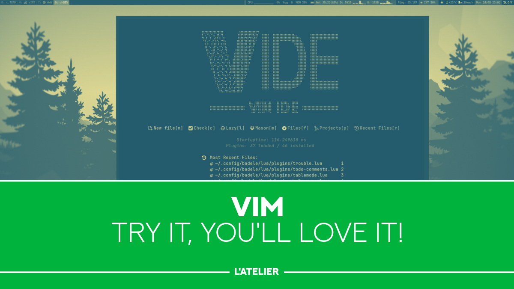
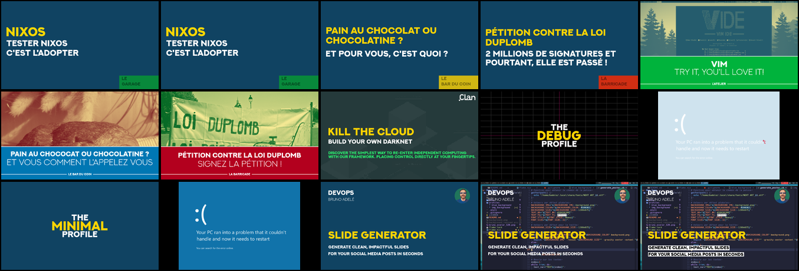
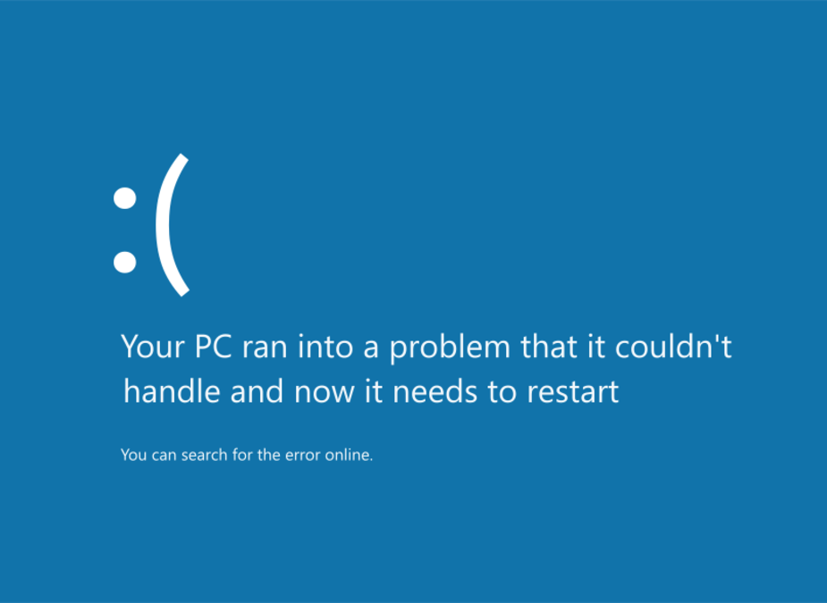

# slide-generator

Generate clean, impactful slides for your social media posts in seconds.

## Usage

The slide generator uses a simple CLI interface with profiles and customizable
variables. We can calling this **Slide As Code (SAC)**

### Basic syntax

```bash
./generate_slide.sh --profile PROFILE_NAME [--set VAR=VALUE ...]
```

### Options

- `--profile PROFILE_NAME` : Load a profile from the `profiles/` directory
  (required)
- `--set VAR=VALUE` : Set or override any variable (can be used multiple times)
- `--help` : Show help and usage examples

## Examples

### [Minimal profile](./profiles/minimal/)

With this profile, all parameters must be entered. Below are some examples of
profiles with pre-filled parameters.

```bash
./generate_slide.sh --profile minimal \
  --set BACKGROUND_COLOR="#104362" \
  --set TEXT1="THE" \
  --set TEXT1_GEOMETRY="+0-64" \
  --set TEXT2="minimal" \
  --set TEXT2_FONT_SIZE=96 \
  --set TEXT2_FG="#FFD300" \
  --set TEXT2_GEOMETRY="+0-0" \
  --set TEXT3="profile" \
  --set TEXT3_GEOMETRY="+0+64"
```


### [User post profile](./profiles/user_post/)

Example of using different parameters for the same profile

#### Blue background

```bash
./generate_slide.sh --profile user_post \
  --set TEXT2="DEVOPS" \
  --set TEXT3="BRUNO ADELÉ" \
  --set TEXT4="SLIDE GENERATOR" \
  --set TEXT5="Generate clean, impactful slides" \
  --set TEXT6="for your social media posts in seconds" \
  --set IMG99="https://raw.githubusercontent.com/badele/slide-generator/refs/heads/main/bruno_avatar_128.png"
```


#### Custom background image

```bash
./generate_slide.sh --profile user_post \
  --set IMG1="/home/badele/Pictures/2025-04-26_19-07.png" \
  --set TEXT2="DEVOPS" \
  --set TEXT3="BRUNO ADELÉ" \
  --set TEXT4="SLIDE GENERATOR" \
  --set TEXT5="Generate clean, impactful slides" \
  --set TEXT6="for your social media posts in seconds" \
  --set IMG99="https://raw.githubusercontent.com/badele/slide-generator/refs/heads/main/bruno_avatar_128.png"
```



#### Image with contrasted text

```bash
./generate_slide.sh --profile user_post \
  --set IMG1="/home/badele/Pictures/2025-04-26_19-07.png" \
  --set TEXT2="DEVOPS" \
  --set TEXT3="BRUNO ADELÉ" \
  --set TEXT4="SLIDE GENERATOR" \
  --set TEXT5="Generate clean, impactful slides" --set TEXT5_BG="#FFFFFF" --set TEXT5_FG="#000000" \
  --set TEXT6="for your social media posts in seconds" --set TEXT6_BG="#FFFFFF" --set TEXT6_FG="#000000" \
  --set IMG99="https://raw.githubusercontent.com/badele/slide-generator/refs/heads/main/bruno_avatar_128.png"
```


### [bottom title block](./profiles/bottom_title_block/)

```bash
./generate_slide.sh --profile bottom_title_block \
  --set COMMAND1="https://raw.githubusercontent.com/badele/vide/main/doc/img/plug_dashboard.png -resize x675  -gravity northwest -geometry +0+0 -composite" \
  --set COMMAND2="-fill '#10701a'  -draw 'rectangle 0,422 1200,675'" \
  --set TEXT5="VIM" \
  --set TEXT6="Try it, you\'ll love it!" --set TEXT99_BG="'#10701a'" \
  --set TEXT99="L'atelier" --set TEXT99_EFFECTS_AFTER="-trim -bordercolor '#10701a' -border 12x0"
```



### Other examples

You can see other examples on [profiles](./profiles/) folder

[](./profiles/)

## From SVG image

You can also replace text from a SVG file.

```bash
./generate_slide.sh --profile minimal \
  --set IMG_BACKGROUND="https://raw.githubusercontent.com/badele/slide-generator-templates/refs/heads/main/windows8_BSOD/template.svg" \
  --set TEXT1="Your PC ran into a problem that it couldn’t" \
  --set TEXT2="handle and now it needs to restart" \
  --set TEXT3="You can search for the error online."
```



## Customization

You can customize any aspect of your slide by using the `--set` option:

### Text customization

```bash
# Change text content
--set TEXT1="Your title"
--set TEXT2="Your subtitle"

# Change text colors
--set TEXT3_FG="#FFD300"  # Foreground color
--set TEXT3_BG="#FFFFFF"  # Background color

# Change text positioning
--set TEXT1_GEOMETRY="+100+200"

# Change font style and size
--set TEXT1_FONT_STYLE="Light"
--set TEXT1_FONT_SIZE=48
```

### Background customization

```bash
# Solid color background
--set BACKGROUND_COLOR="#104362"

# Custom image background
--set BACKGROUND_IMG="/path/to/image.jpg"

# Background size
--set OUTPUT_SIZE="1920x1080"
```

### Image elements

```bash
# Add custom images
--set IMG1="/path/to/logo.png"
--set IMG1_GEOMETRY="+50+50"
--set IMG1_GRAVITY="northeast"
```
