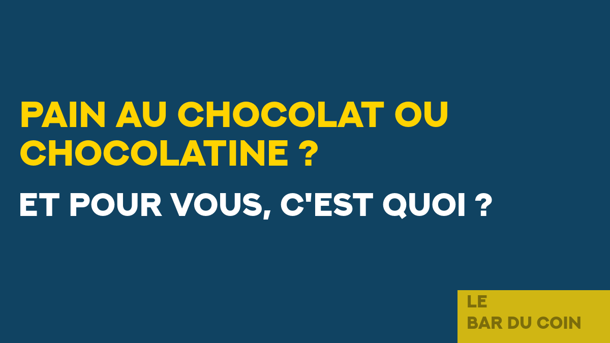
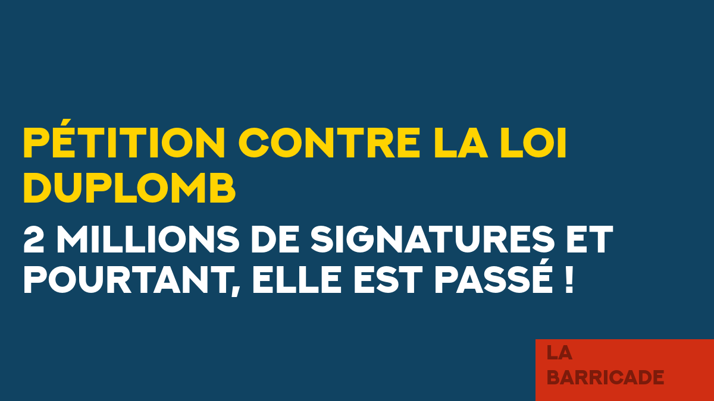

# bottom right title square



```bash
./generate_slide.sh --profile bottom_right_title_square \
  --set COMMAND2="-fill '#069B32CC' -draw 'rectangle 900,571 1200,675'" \
  --set TEXT4="Le" \
  --set TEXT4_FG="#00000066" \
  --set TEXT5="Garage" \
  --set TEXT5_FG="#00000066" \
  --set TEXT6="NixOS" \
  --set TEXT6_FG="gold" \
  --set TEXT6_FONT_SIZE=96 \
  --set TEXT6_GEOMETRY="+40+200" \
  --set TEXT7="tester NixOS" \
  --set TEXT7_FG="#FFFFFF" \
  --set TEXT7_FONT_SIZE=64 \
  --set TEXT7_GEOMETRY="+40+300" \
  --set TEXT8="C'est l'adopter" \
  --set TEXT8_FG="#FFFFFF" \
  --set TEXT8_FONT_SIZE=64 \
  --set TEXT8_GEOMETRY="+40+374" \
```


```bash
./generate_slide.sh --profile bottom_right_title_square \
  --set COMMAND2="-fill '#FFD300CC' -draw 'rectangle 900,571 1200,675'" \
  --set TEXT4="Le" \
  --set TEXT4_FG="#00000066" \
  --set TEXT5="bar du coin" \
  --set TEXT5_FG="#00000066" \
  --set TEXT6="Pain au chocolat ou chocolatine ?" \
  --set TEXT6_FG="#FFD300" \
  --set TEXT6_FONT_SIZE=72 \
  --set TEXT6_GEOMETRY="+40+200" \
  --set TEXT7="Et pour vous, c'est quoi ?" \
  --set TEXT7_FG="#FFFFFF" \
  --set TEXT7_FONT_SIZE=64 \
  --set TEXT7_GEOMETRY="+40+380" \
```



```bash
./generate_slide.sh --profile bottom_right_title_square \
  --set COMMAND2="-fill '#FF2900CC' -draw 'rectangle 900,571 1200,675'" \
  --set TEXT4="La" \
  --set TEXT4_FG="#00000066" \
  --set TEXT5="Barricade" \
  --set TEXT5_FG="#00000066" \
  --set TEXT6="Pétition contre la loi Duplomb" \
  --set TEXT6_FG="#FFD300" \
  --set TEXT6_FONT_SIZE=72 \
  --set TEXT6_GEOMETRY="+40+200" \
  --set TEXT7="2 millions de signatures et pourtant, elle est passé \!" \
  --set TEXT7_FG="#FFFFFF" \
  --set TEXT7_FONT_SIZE=64 \
  --set TEXT7_GEOMETRY="+40+380"
```
