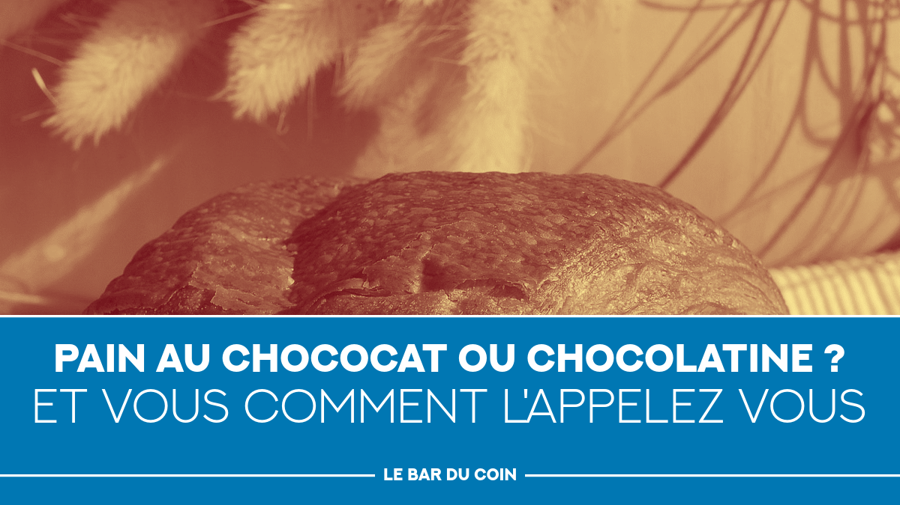

# Bottom title block


```bash
./generate_slide.sh --profile bottom_title_block \
  --set COMMAND1="https://raw.githubusercontent.com/badele/vide/main/doc/img/plug_dashboard.png -resize x675  -gravity northwest -geometry +0+0 -composite" \
  --set COMMAND2="-fill '#00B33C'  -draw 'rectangle 0,422 1200,675'" \
  --set TEXT5="VIM" \
  --set TEXT6="Try it, you\'ll love it\!" --set TEXT99_BG="'#00B33C'" \
  --set TEXT99="L'atelier" --set TEXT99_EFFECTS_AFTER="-trim -bordercolor '#00B33C' -border 12x0"
```



```bash
./generate_slide.sh --profile bottom_title_block \
  --set TEXT_FG="#000000" \
  --set COMMAND1="https://upload.wikimedia.org/wikipedia/commons/thumb/5/5f/Pain_au_chocolat_Luc_Viatour.jpg/1280px-Pain_au_chocolat_Luc_Viatour.jpg -resize 1200x  -gravity northwest -geometry +0+0 -composite" \
  --set COMMAND2="-fill '#0077B3'  -draw 'rectangle 0,422 1200,675'" \
  --set TEXT5="pain au chococat ou chocolatine ?" \
  --set TEXT5_FONT_SIZE=52 \
  --set TEXT6="Et vous comment l'appelez vous" --set TEXT99_BG="#0077B3" \
  --set TEXT99="Le bar du coin" --set TEXT99_EFFECTS_AFTER="-trim -bordercolor '#0077B3' -border 12x0"
```


```bash
./generate_slide.sh --profile bottom_title_block \
  --set COMMAND1="https://www.francebleu.fr/s3/cruiser-production-eu3/2025/08/910a2661-bdf1-4bc5-bb7c-214b50d1d2a3/1200x680_sc_loi-duplomb.jpg -resize 1200x  -gravity northwest -geometry +0+0 -composite" \
  --set COMMAND2="-fill '#B3001E'  -draw 'rectangle 0,422 1200,675'" \
  --set TEXT5="Pétition contre la loi Duplomb" \
  --set TEXT5_FONT_SIZE=52 \
  --set TEXT6="Signez la pétition \!" --set TEXT99_BG="#B3001E" \
  --set TEXT99="La barricade" --set TEXT99_EFFECTS_AFTER="-trim -bordercolor '#B3001E' -border 12x0"
```
