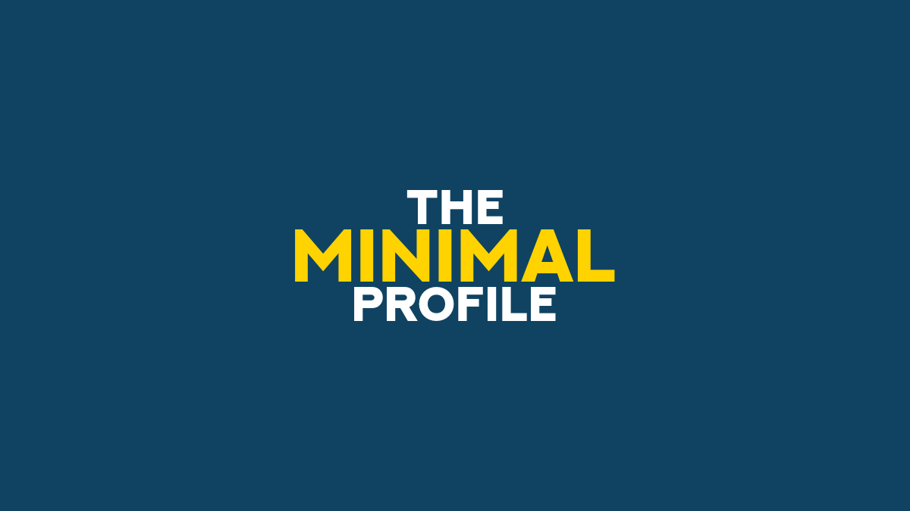
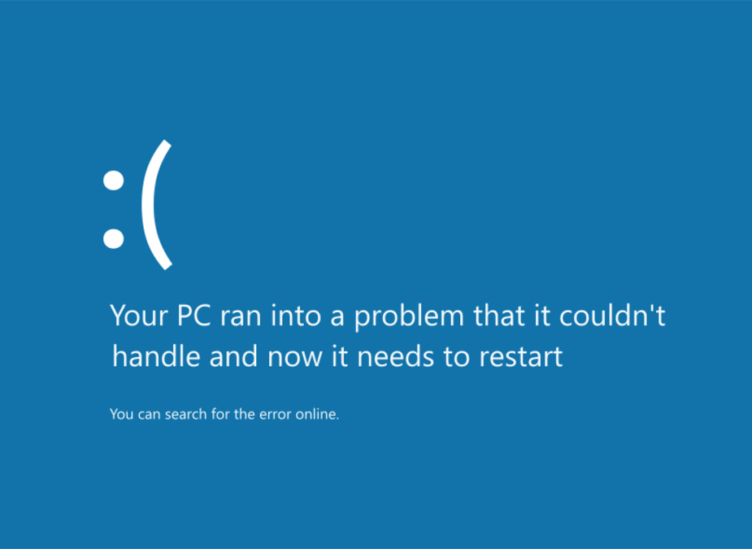

# minimal profile

## Minimal



```bash
./generate_slide.sh --profile minimal \
  --set BACKGROUND_COLOR="#104362" \
  --set TEXT1="THE" \
  --set TEXT1_GEOMETRY="+0-64" \
  --set TEXT2="minimal" \
  --set TEXT2_FG="#FFD300" \
  --set TEXT2_FONT_SIZE=96 \
  --set TEXT2_GEOMETRY="+0-0" \
  --set TEXT3="profile" \
  --set TEXT3_GEOMETRY="+0+64"
```

## Use remote SVG



```bash
./generate_slide.sh --profile minimal \
  --set BACKGROUND_IMG="https://raw.githubusercontent.com/badele/slide-generator-templates/refs/heads/main/windows8_BSOD/template.svg" \
  --set TEXT1="Your PC ran into a problem that it couldn't" \
  --set TEXT2="handle and now it needs to restart" \
  --set TEXT3="You can search for the error online."
```
