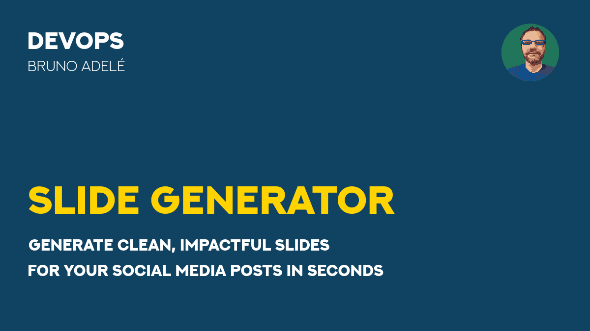

# User post profile

## Blue background



```bash
./generate_slide.sh --profile user_post \
  --set TEXT2="DEVOPS" \
  --set TEXT3="BRUNO ADELÉ" \
  --set TEXT4="SLIDE GENERATOR" \
  --set TEXT5="Generate clean, impactful slides" \
  --set TEXT6="for your social media posts in seconds" \
  --set IMG99="https://raw.githubusercontent.com/badele/slide-generator/refs/heads/main/bruno_avatar_128.png"
```

## Custom background image


```bash
./generate_slide.sh --profile user_post \
  --set IMG1="/home/badele/Pictures/2025-04-26_19-07.png" \
  --set TEXT2="DEVOPS" \
  --set TEXT3="BRUNO ADELÉ" \
  --set TEXT4="SLIDE GENERATOR" \
  --set TEXT5="Generate clean, impactful slides" \
  --set TEXT6="for your social media posts in seconds" \
  --set IMG99="https://raw.githubusercontent.com/badele/slide-generator/refs/heads/main/bruno_avatar_128.png"
```


```bash
./generate_slide.sh --profile user_post \
  --set IMG1="/home/badele/Pictures/2025-04-26_19-07.png" \
  --set TEXT2="DEVOPS" \
  --set TEXT3="BRUNO ADELÉ" \
  --set TEXT4="SLIDE GENERATOR" \
  --set TEXT5="Generate clean, impactful slides" --set TEXT5_BG="#FFFFFF" --set TEXT5_FG="#000000" --set TEXT5_EFFECTS="-trim -bordercolor '#FFFFFF' -border 5x5" \
  --set TEXT6="for your social media posts in seconds" --set TEXT6_BG="#FFFFFF" --set TEXT6_FG="#000000" --set TEXT6_EFFECTS="-trim -bordercolor '#FFFFFF' -border 5x5" \
  --set IMG99="https://raw.githubusercontent.com/badele/slide-generator/refs/heads/main/bruno_avatar_128.png"
```
